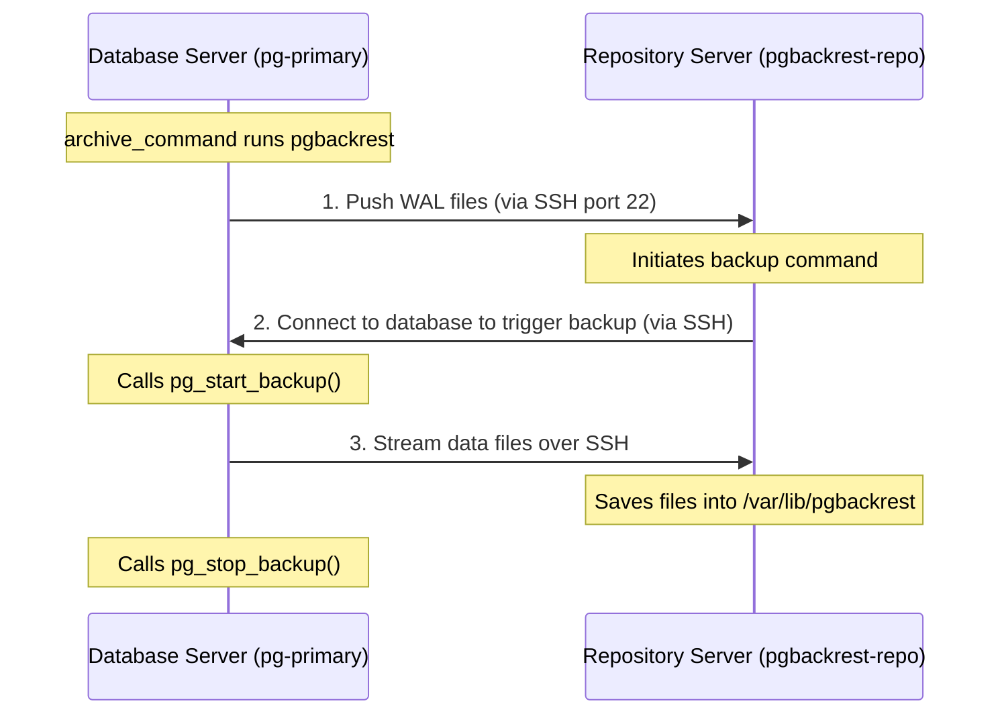

# Lab 1: Dedicated pgBackRest Repository Server via SSH

## 🎯 Objectives
- Configure pgBackRest to communicate with a dedicated repository host using secure shell (SSH) connection.
- Initialize the pgBackRest storage layout (stanza creation).
- Force WAL archiving and verify its integration.
- Trigger manual Full and Incremental backups.
- Simulate complete database corruption and perform a successful bare-metal restore.

---

## 🏗️ Architecture

In production setups, storing backups on the database host is a major anti-pattern. This lab implements a two-node configuration:
1. **`pg-primary`**: The PostgreSQL 16 database server.
2. **`pgbackrest-repo`**: The backup repository server.

Both nodes run SSH and share passwordless SSH key authentication for the `postgres` user.



---

## ⚙️ Configuration Files

### Database Host Config (`pg-primary.conf` ➡️ `/etc/pgbackrest/pgbackrest.conf`)
The database host defines how to locate the repository server:
```ini
[global]
repo1-host=pgbackrest-repo      # The repository hostname/IP
repo1-host-user=postgres        # The SSH login user on the repo
log-level-console=info
log-level-file=debug
start-fast=y                    # Forces checkpoints to run immediately during backups

[demo]
pg1-path=/var/lib/postgresql/16/main  # Path to database data directory
```

### Repository Host Config (`pgbackrest-repo.conf` ➡️ `/etc/pgbackrest/pgbackrest.conf`)
The repository host defines where backups are stored, and where the primary database lives:
```ini
[global]
repo1-path=/var/lib/pgbackrest  # Directory where backups are written

[demo]
pg1-host=pg-primary             # The database hostname/IP
pg1-host-user=postgres          # The SSH login user on the database server
pg1-path=/var/lib/postgresql/16/main
```

---

## 🧑‍💻 Hands-On Lab Exercises

### Step 1: Start the Environment
Initialize the Lab 1 containers:
```bash
make up
```
Verify they are running and reachable:
```bash
make status
```

### Step 2: Create the Stanza
A **stanza** is a pgBackRest namespace containing all configuration and files for a specific database cluster. 
Run the creation command from the repository server:
```bash
make stanza-create
```
Observe the logs. pgBackRest connects to `pg-primary` via SSH, verifies directories, and initializes the repository metadata structures inside `/var/lib/pgbackrest`.

### Step 3: Validate the Configuration
Run a validation check to make sure WAL archiving and database connectivity are configured correctly:
```bash
make check
```
If successful, you will see `check command end: completed successfully`. This verifies that the database `archive_command` can push WAL files directly to the repository server.

### Step 4: Perform Backups
1. **Insert initial data** into the primary database:
   ```bash
   docker exec -u postgres pg-primary psql -c "
       CREATE TABLE test_table (id serial PRIMARY KEY, val text);
       INSERT INTO test_table (val) VALUES ('Initial data');
   "
   ```

2. **Run a Full Backup**:
   ```bash
   make backup-full
   ```
   Inspect the output. Note that pgBackRest creates checkpoints, copies the files, and creates a backup manifest.

3. **Insert new data**:
   ```bash
   docker exec -u postgres pg-primary psql -c "INSERT INTO test_table (val) VALUES ('Incremental data');"
   ```

4. **Run an Incremental Backup**:
   ```bash
   make backup-incr
   ```
   Note how quickly this completes, copying only the files that changed since the Full backup.

5. **Inspect the Repository**:
   List all backups currently stored in the repository:
   ```bash
   make info
   ```

---

## 💥 Disaster Recovery Simulation

Now, we will simulate a catastrophic disk failure on the primary database server by completely wiping its data directory.

### Step 1: Corrupt the Database
We stop PostgreSQL immediately and delete all files in the data directory:
```bash
make corrupt
```
Try querying the database. It is dead, and the directory is empty.

### Step 2: Restore from Backup
Run the pgBackRest restore command **on the primary database host**:
```bash
make restore
```
> [!NOTE]
> Restore operations must run on the database host because pgBackRest needs to write files directly to the local filesystem path specified by `pg1-path`.

### Step 3: Start the Database & Verify Data
Start the database server:
```bash
make start-db
```
Wait a few seconds for it to initialize, then verify that all data (both from the full and incremental backups) is intact:
```bash
docker exec -u postgres pg-primary psql -c "SELECT * FROM test_table;"
```
You should see:
```
 id |       val        
----+------------------
  1 | Initial data
  2 | Incremental data
```

---

## 🧹 Cleanup
When finished, stop the environment and clean all volumes:
```bash
make down
```

---

## 💡 Key Takeaways
1. **Communication Loop**: In a standard SSH setup, pgBackRest running on the repository host acts as the orchestrator, SSHing into the database host to query status, while database WAL archivers push WALs back to the repository.
2. **Restore Direction**: Backups are orchestrated from the repository host, but restores are always run locally on the database host.
3. **No Database Service Needed on Repo**: The repository host does not run a PostgreSQL database instance. It only processes files using the pgBackRest binary.
