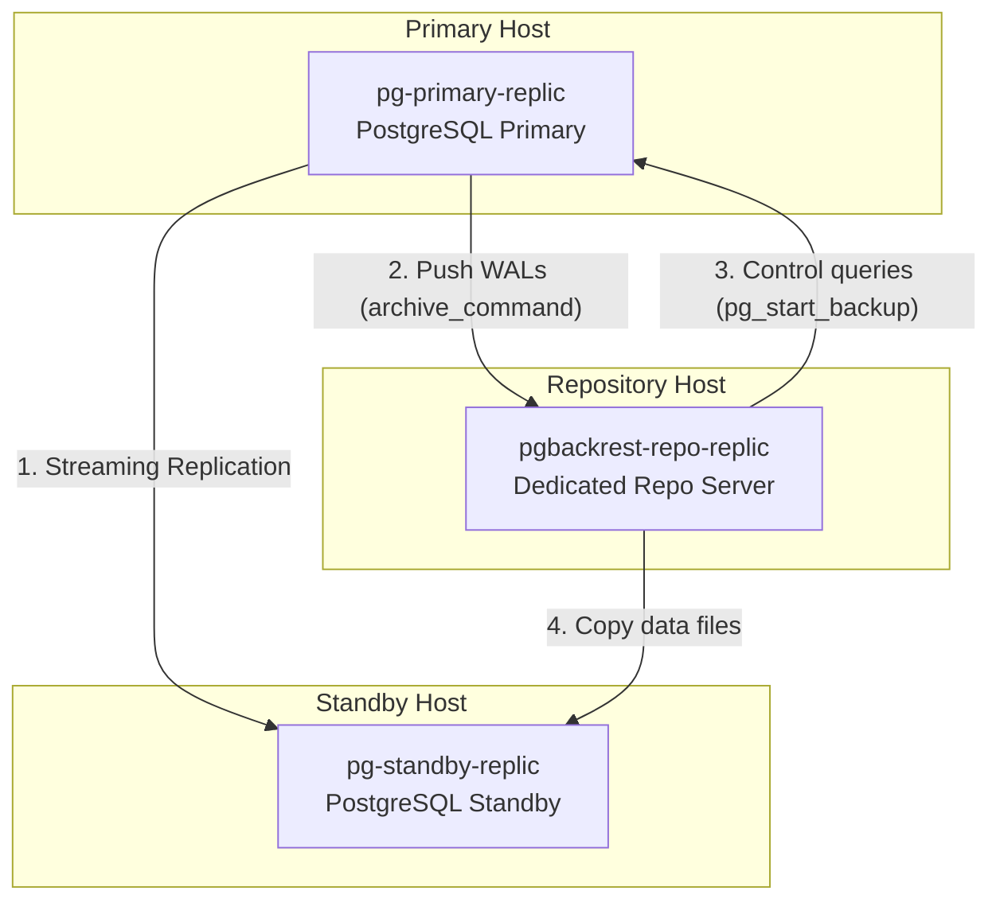

# Lab 3: Backup Offloading to Standby (Replica)

## 🎯 Objectives
- Configure pgBackRest to offload CPU and Disk I/O intensive backup operations from the primary database to a physical standby replica.
- Understand how pgBackRest coordinates backups between primary control commands and standby file streaming.
- Rebuild a corrupted standby database from scratch using pgBackRest bootstrap capabilities (`--type=standby` restore).

---

## 🏗️ Architecture

In high-transaction production environments, taking a full backup directly from the primary database can lead to disk I/O bottlenecks and impact client response times. pgBackRest allows offloading the file-copy phase to a standby replica, while still securing transaction consistency.



### ⚙️ How Backup from Standby Works
1. **Control Phase**: pgBackRest connects to `pg-primary` via SSH to run `pg_backup_start()`. This creates a consistent checkpoint and records start LSN.
2. **File Copy Phase**: pgBackRest connects to `pg-standby` via SSH and copies all database files (the bulk of the operation) directly from the replica to the repository server.
3. **Completion Phase**: pgBackRest connects back to `pg-primary` to run `pg_backup_stop()` and finalize metadata.

---

## ⚙️ Configuration Files

### Repository Host Config (`pgbackrest-repo.conf` ➡️ `/etc/pgbackrest/pgbackrest.conf`)
The repository server must know about both database hosts and be instructed to use the standby:
```ini
[global]
repo1-path=/var/lib/pgbackrest
log-level-console=info
log-level-file=debug

[demo]
pg1-host=pg-primary-replic        # Database Host 1 (Primary)
pg1-host-user=postgres
pg1-path=/var/lib/postgresql/16/main

pg2-host=pg-standby-replic        # Database Host 2 (Standby)
pg2-host-user=postgres
pg2-path=/var/lib/postgresql/16/main

backup-standby=y                  # Instructs pgBackRest to copy files from pg2 if it is a standby
```

---

## 🧑‍💻 Hands-On Lab Exercises

### Step 1: Start the Environment
Initialize the Lab 3 containers:
```bash
make up
```
This launches a primary-standby database pair and the repository host, setting up streaming replication automatically.

Verify that streaming replication is active:
```bash
make status
```
You should see `pg-standby-replic` connected in `streaming` state under the replication status section.

### Step 2: Create the Stanza
Run stanza creation from the repository server:
```bash
make stanza-create
```

### Step 3: Validate the Configuration
Run pgBackRest validation check:
```bash
make check
```
Observe the logs. pgBackRest will connect to both the primary and standby hosts to verify configuration parity.

### Step 4: Perform a Standby-Offloaded Backup
1. **Write test data** to the primary database:
   ```bash
   docker exec -u postgres pg-primary-replic psql -c "
       CREATE TABLE test_table (id serial PRIMARY KEY, val text);
       INSERT INTO test_table (val) VALUES ('Initial replica test data');
   "
   ```

2. **Trigger the backup** from the repository host:
   ```bash
   make backup
   ```
   Inspect the log messages. Note how pgBackRest discovers that `pg2-host` is the standby, connects to it, and pulls files from it instead of the primary.

---

## 💥 Standby Rebuild & Bootstrap Simulation

We will simulate a catastrophic failure on the standby node and use pgBackRest to restore and bootstrap it back into the replication loop.

### Step 1: Destroy the Standby Node
Stop the standby database and delete its data files:
```bash
make stop-standby
docker exec -u postgres pg-standby-replic bash -c "rm -rf /var/lib/postgresql/16/main/*"
```
Verify the standby is offline:
```bash
make status
```

### Step 2: Bootstrap Standby from Backup
Run the bootstrap command:
```bash
make bootstrap-standby
```
Let's analyze what this command did:
1. Ran `pgbackrest --stanza=demo --type=standby restore`.
   - The `--type=standby` flag tells pgBackRest that we are restoring a replica node.
   - It restores all data files.
   - It automatically creates the `standby.signal` file in the restored directory (which tells PostgreSQL 16 to start up as a standby replica, not a primary).
2. Appends `primary_conninfo` to `postgresql.auto.conf`:
   - Sets host to `pg-primary-replic` and user/password for streaming.
3. Starts the database.

### Step 3: Verify Replication Resumes
Check replication status:
```bash
make status
```
The standby should be back online, streaming, and synchronized!

Let's test replication:
1. **Insert new data** on the primary:
   ```bash
   docker exec -u postgres pg-primary-replic psql -c "INSERT INTO test_table (val) VALUES ('Data after replica bootstrap');"
   ```
2. **Verify it streams** to the standby:
   ```bash
   docker exec -u postgres pg-standby-replic psql -c "SELECT * FROM test_table;"
   ```

---

## 🧹 Cleanup
Stop the lab and clean the volumes:
```bash
make down
```

---

## 💡 Key Takeaways
1. **Offloading IO**: `backup-standby=y` offloads file transfers (disk and network I/O) to the standby replica, protecting primary performance.
2. **Standby Bootstrapping**: Rebuilding replicas with pgBackRest using `--type=standby` is extremely efficient and automatically handles `standby.signal` creation.
3. **Configuration Parity**: pgBackRest requires database and stanza configurations to match on both hosts (`pg1-path` and `pg2-path` must point to identical paths).
